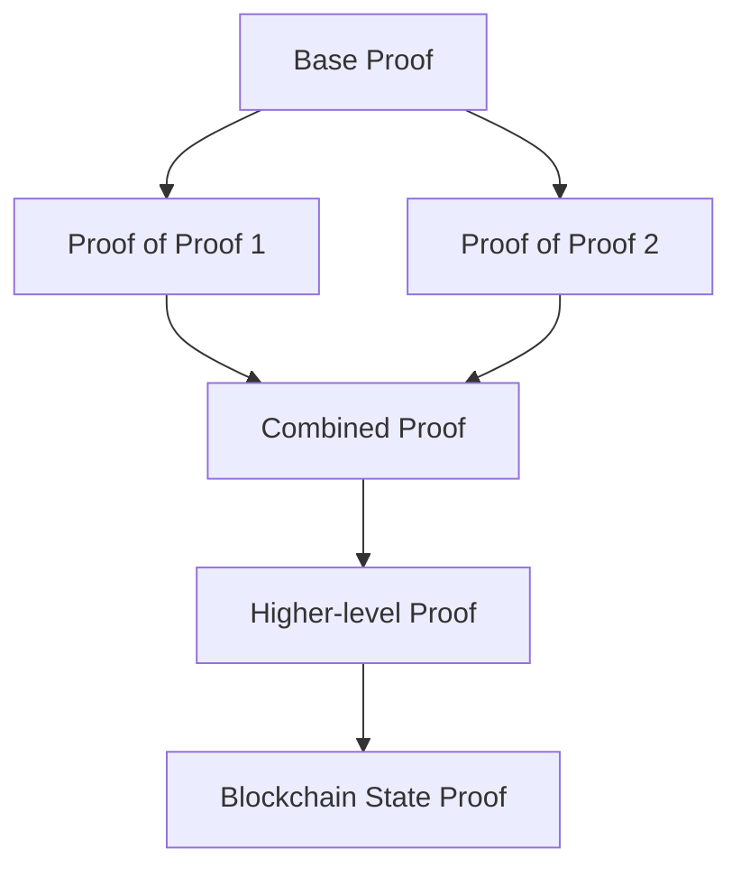
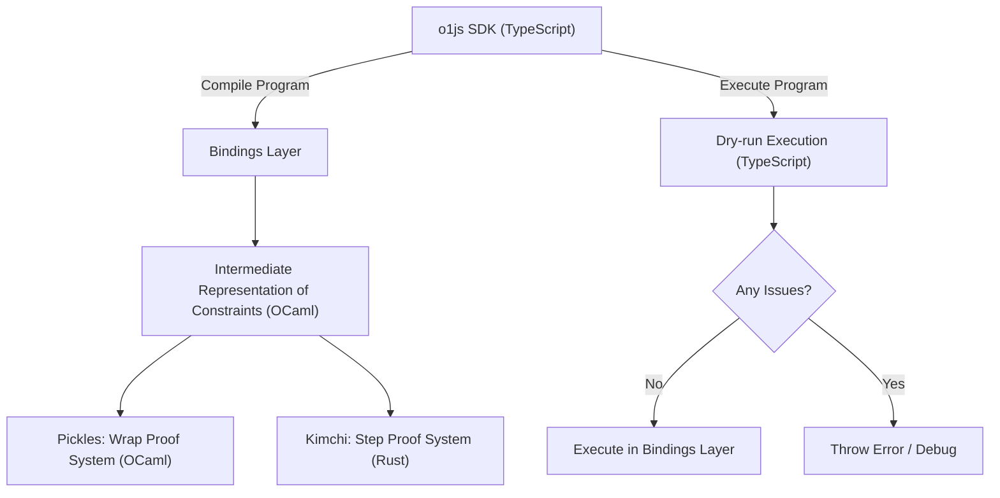

# Part 1: Core Architecture and Philosophy - Mina Protocol, o1js, and Zeko Labs

> **AI Agent Guidance**: This document provides foundational knowledge about the Mina ecosystem. Use this information to explain architectural concepts to users and guide technology stack decisions.

## Overview of the Complete Ecosystem

### The Three-Layer Architecture

**Stack Overview for AI Agents:**

- **Development Layer**: o1js (TypeScript SDK for creating zk-SNARK circuits)
- **Base Protocol**: Mina L1 (22KB blockchain with recursive proofs)
- **Performance Layer**: Zeko L2 (High throughput while maintaining compatibility)

```
┌─────────────────────────────────┐
│          Zeko L2                │  ← High throughput, instant finality
│     (Enhanced Performance)      │     Compatible with all Mina tooling
├─────────────────────────────────┤
│          Mina L1                │  ← 22KB blockchain, zk-recursive proofs
│      (Base Security Layer)      │     True decentralization
├─────────────────────────────────┤
│           o1js                  │  ← TypeScript → zk-SNARK circuits
│    (Development Framework)      │     Constraint system programming
└─────────────────────────────────┘
```

## Mina Protocol: Fundamental Architecture

### Core Philosophy and Unique Advantages

**Mina is fundamentally different from all other blockchains:**

1. **Constant Size Blockchain**: 22KB forever through recursive zk-SNARKs
2. **Off-chain Execution Model**: zkApps execute client-side, generate proofs verified on-chain
3. **Privacy by Design**: Zero-knowledge execution with selective disclosure
4. **Scalability via Recursion**: Infinite recursion capability unique among blockchains

### zkApps: Zero Knowledge Applications

**Definition**: zkApps are zero knowledge applications built on Mina Protocol using zk-SNARKs that execute off-chain and prove their correctness on-chain.

**Key Architectural Advantages:**

- **Scalability**: Fixed 22KB blockchain size through recursive proofs
- **Privacy**: Zero-knowledge execution with optional privacy
- **Cost Efficiency**: Constant transaction costs vs. variable gas fees
- **Developer Experience**: TypeScript-based development using familiar tools

**Execution Model Comparison:**

| Aspect        | Ethereum                  | Mina zkApps                          |
| ------------- | ------------------------- | ------------------------------------ |
| **Language**  | Solidity                  | TypeScript (o1js)                    |
| **Execution** | On every node             | Client-side with proof verification  |
| **Costs**     | Variable gas fees         | Constant small fees                  |
| **Storage**   | All state on-chain        | Flexible on/off-chain storage        |
| **Scaling**   | Limited by node execution | Exponential via recursive proofs     |
| **Privacy**   | Public by default         | Private inputs, selective disclosure |
| **Consensus** | ~700GB blockchain         | 22KB recursive proof                 |

### Proof System Architecture

**Kimchi + Pickles System:**

- **Kimchi**: Step proof system (Rust implementation)
- **Pickles**: Wrap proof system enabling recursion (OCaml implementation)
- **Infinite Recursion**: Only blockchain supporting unbounded recursive proof composition

**Recursive Proof Capabilities:**



### Network Architecture and Consensus

**Consensus Mechanism:**

- **Ouroboros Proof-of-Stake**: Energy-efficient consensus
- **SNARK Workers**: Specialized nodes for proof generation
- **Block Producers**: Nodes that create and propose blocks
- **Archive Nodes**: Full historical data storage

**Network Topology:**

- **Mainnet**: Production L1 with full decentralization
- **Devnet/Berkeley**: Testing network with test MINA tokens
- **Local Blockchain**: Development environment for testing

## o1js Framework: The Core Development Layer

### Framework Architecture and Philosophy

**o1js is NOT JavaScript**: It's a TypeScript SDK with bindings to Rust and OCaml that creates constraint systems by executing TypeScript code.



### Two-Phase Execution Model

**Critical Concept**: o1js operates in two distinct phases that developers must understand:

1. **Compile Time (Circuit Structure Determination)**:

   - Uses regular JavaScript/TypeScript execution
   - Determines the structure of the constraint system
   - Optimizations and conditional circuit inclusion happen here

2. **Prove Time (Fixed Circuit Execution)**:
   - Circuit structure is fixed and cannot change
   - Values flow through predetermined constraint paths
   - All conditional logic must use provable operations

**Example of Two-Phase Design:**

```typescript
// COMPILE TIME: Circuit structure determination
if (keyLength > 64) {
  // Add SHA-256 constraints to circuit
  keyHash = sha256Hash(keyBytes);
} else {
  // Add padding-only constraints to circuit
  keyHash = padWithZeros(keyBytes);
}

// PROVE TIME: Value selection within fixed circuit
const result = Provable.if(condition, valueA, valueB);
```

### Constraint System Programming Model

**Fundamental Principle**: Every operation in o1js must be expressible as polynomial constraints over finite fields.

**Key Constraints:**

- **No Dynamic Programming**: Loop bounds and conditional paths must be static at compile time
- **No Traditional Branching**: Must use `Provable.if()` for conditional values
- **Fixed Circuit Structure**: Same constraints must be generated on every execution
- **Size Limitations**: Larger circuits increase proof generation time exponentially

**Valid vs Invalid Patterns:**

```typescript
// ❌ INVALID - Traditional conditionals don't work in provable code
if (condition) {
  x.assertEquals(y);
}

// ✅ VALID - Use Provable.if for conditional values
const result = Provable.if(condition, valueA, valueB);

// ❌ INVALID - Dynamic loops aren't supported
for (let i = 0; i < dynamicLength; i++) {
  // This breaks circuit consistency
}

// ✅ VALID - Fixed-size arrays and loops
const MyArray = Provable.Array(Field, 10);
for (let i = 0; i < 10; i++) {
  // Always executes exactly 10 times
}

// ❌ INVALID - Side effects in conditional paths
Provable.if(
  condition,
  () => {
    counter.increment();
    return valueA;
  }, // Both paths execute!
  () => {
    counter.increment();
    return valueB;
  }
);

// ✅ VALID - Pure value selection
const value = Provable.if(condition, valueA, valueB);
value.assertEquals(expectedValue);
```

## Zeko Labs: L2 Performance Layer

### What is Zeko?

Zeko is a Layer 2 ecosystem specifically designed for Mina's zero-knowledge applications (zkApps) that provides:

- **Fully Mina-equivalent application layer**
- **Improved throughput and quick confirmation times**
- **Seamless compatibility with existing Mina tooling**
- **Modular architecture for customization**

### L1/L2 Integration Architecture

**Nested Ledger Model**: Zeko operates as a nested Mina ledger contained within a zkApp's account state on L1.

**Core Components:**

- **Outer Account (L1)**: Tracks the ledger hash of the inner ledger and manages withdrawals
- **Inner Account (L2)**: Mirrors the outer account and manages deposits
- **Special Bridge Account**: Connects L1 and L2 with a unique public key

### Performance Characteristics Comparison

| Metric               | Mina L1             | Zeko L2                          |
| -------------------- | ------------------- | -------------------------------- |
| **Finality**         | 3-5 minutes         | ~10 seconds                      |
| **Throughput**       | 24 zkApp tx/block   | No practical limit               |
| **Cost**             | ~0.1 MINA           | Fraction of L1 cost              |
| **Decentralization** | Full                | Sequencer-based                  |
| **Security**         | zk-recursive proofs | Inherits from L1                 |
| **Account Updates**  | ~7 per transaction  | No limit (centralized sequencer) |

### Key Architectural Components

#### 1. Sequencer

- **Role**: Acts as the "conductor" of the Zeko ecosystem
- **Functions**:
  - Transaction collection and state application
  - Zero-knowledge proof verification
  - Batch processing for efficient L1 settlement
  - L1 bridge communication via smart contracts
- **Performance**: Sub-second transaction processing
- **API**: Exposes GraphQL API (subset of L1 GraphQL + L1 API for actions/events)

#### 2. Modular Data Availability Layer

- **Current Implementation**: Fork of EVM chain (Ethermint) with instant finality consensus
- **Modularity Benefits**:
  - Flexibility to choose different DA solutions
  - Customization for specific application needs
  - Future integration with solutions like Celestia
- **Security**: Prevents data withholding attacks and ensures transaction data availability

#### 3. Circuit Architecture

- **Outer Circuit**: For L1 zkApp operations
- **Inner Circuit**: For L2 transfer handling
- **Transaction Wrapper Circuit**: For wrapping transaction SNARKs
- **Action State Extension Circuit**: For proving action state extensions
- **Helper Token Owner Circuit**: For tracking processed transfers

### Bridge Operations and Transfer Mechanism

**Deposit Process (L1 → L2):**

1. Actions submitted to outer account with MINA
2. Recipients finalize deposits by claiming from L1 account
3. Transfer state managed via token-based approach
4. Action state tracking maintains processed vs. pending transfers

**Withdrawal Process (L2 → L1):**

1. Reverse process with similar action-based mechanism
2. Users prove transfer hasn't been processed before
3. Async API for creating transfer requests
4. Polling mechanism for proved account updates

### Development Experience

**Seamless Integration**: Existing Mina tools, libraries, and wallets work out-of-the-box with Zeko.

**Network Configuration Example:**

```typescript
// Same codebase works on both layers!
class MyDapp extends SmartContract {
  @method async execute() {
    // This code runs identically on L1 and L2
  }
}

// L1 Configuration
const minaL1 = Mina.Network({
  networkId: "mainnet",
  mina: "https://api.minascan.io/node/mainnet/v1/graphql",
});

// L2 Configuration
const zekoL2 = Mina.Network({
  networkId: "zeko",
  mina: "https://devnet.zeko.io/graphql",
  archive: "https://devnet.zeko.io/graphql",
});
```

## Mina Transaction Model and Account Updates

**Critical AI Agent Knowledge**: Understanding Mina's unique transaction model is essential for building any zkApp.

### **AccountUpdate: The Transaction Building Block**

Every Mina transaction consists of one or more **AccountUpdates** - atomic state changes to accounts:

```typescript
// Basic transaction structure
const tx = await Mina.transaction(senderPublicKey, () => {
  // Each contract method call creates AccountUpdates
  contract.myMethod(args);

  // You can also create manual AccountUpdates
  AccountUpdate.fundNewAccount(senderPublicKey); // Pay for new account creation
});

// Prove and send
await tx.prove();
await tx.send();
```

### **Key Transaction Concepts**

```typescript
import { Mina, PrivateKey, PublicKey, AccountUpdate } from "o1js";

// 1. Network Connection (Essential First Step)
const Local = Mina.LocalBlockchain({ proofsEnabled: true });
Mina.setActiveInstance(Local);

// Or connect to live network
const network = Mina.Network({
  mina: "https://api.minascan.io/node/devnet/v1/graphql",
  archive: "https://api.minascan.io/archive/devnet/v1/graphql",
});
Mina.setActiveInstance(network);

// 2. Key Management
const deployerKey = PrivateKey.random();
const deployerAccount = deployerKey.toPublicKey();

// Fund account (for local blockchain)
const localAccounts = Local.testAccounts;
const fundingAccount = localAccounts[0].privateKey;

// 3. Contract Deployment Pattern
const contractKey = PrivateKey.random();
const contractAddress = contractKey.toPublicKey();
const contract = new MyContract(contractAddress);

const deployTx = await Mina.transaction(deployerAccount, () => {
  AccountUpdate.fundNewAccount(deployerAccount); // Pay for account creation
  contract.deploy({ zkappKey: contractKey });
});

await deployTx.prove();
await deployTx.sign([deployerKey, contractKey]).send();

// 4. Contract Interaction Pattern
const interactionTx = await Mina.transaction(deployerAccount, () => {
  contract.myMethod(arg1, arg2);
});

await interactionTx.prove();
await interactionTx.sign([deployerKey]).send();
```

### **Account Update Permissions and Security**

```typescript
class SecureContract extends SmartContract {
  init() {
    super.init();

    // Set account permissions for security
    this.account.permissions.set({
      ...Permissions.default(),
      editState: Permissions.proofOrSignature(),
      send: Permissions.proofOrSignature(),
      receive: Permissions.none(),
      incrementNonce: Permissions.proofOrSignature(),
      setDelegate: Permissions.impossible(),
      setPermissions: Permissions.impossible(),
      setVerificationKey: Permissions.impossible(),
      setZkappUri: Permissions.impossible(),
      setTokenSymbol: Permissions.impossible(),
      setVotingFor: Permissions.impossible(),
    });
  }
}
```

### **Network Configuration Patterns**

```typescript
// AI Agent Helper: Network configuration for different environments
export class NetworkManager {
  static setupLocal(): void {
    const Local = Mina.LocalBlockchain({
      proofsEnabled: true,
      enforceTransactionLimits: false, // For testing
    });
    Mina.setActiveInstance(Local);
  }

  static setupDevnet(): void {
    const network = Mina.Network({
      mina: "https://api.minascan.io/node/devnet/v1/graphql",
      archive: "https://api.minascan.io/archive/devnet/v1/graphql",
    });
    Mina.setActiveInstance(network);
  }

  static setupMainnet(): void {
    const network = Mina.Network({
      mina: "https://api.minascan.io/node/mainnet/v1/graphql",
      archive: "https://api.minascan.io/archive/mainnet/v1/graphql",
    });
    Mina.setActiveInstance(network);
  }

  static async waitForTransaction(txHash: string): Promise<void> {
    console.log("Waiting for transaction confirmation...");

    for (let attempt = 0; attempt < 50; attempt++) {
      try {
        const status = await Mina.getTransactionStatus(txHash);
        if (status === "INCLUDED") {
          console.log("Transaction confirmed!");
          return;
        }
      } catch (error) {
        // Transaction not yet included
      }

      await new Promise((resolve) => setTimeout(resolve, 10000)); // Wait 10 seconds
    }

    throw new Error("Transaction confirmation timeout");
  }
}
```

## Strategic Positioning and Use Cases

**AI Agent Decision Framework**: Use this guidance to recommend the appropriate layer based on user requirements.

### When to Use Each Layer

#### **Mina L1 - Recommend for:**

- **Security-first applications**: Maximum decentralization and security
- **Long-term value storage**: DeFi protocols, treasury management
- **Cross-ecosystem bridges**: Interoperability with other blockchains
- **Governance systems**: Protocol upgrades and DAOs
- **Compliance-critical applications**: Regulatory environments requiring maximum security
- **Privacy-preserving applications**: Zero-knowledge proofs with highest security guarantees

**Trade-offs**: 3-5 minute finality, limited throughput

#### **Zeko L2 - Recommend for:**

- **High-frequency applications**: DEX trading, gaming, real-time interactions
- **User experience focused apps**: Applications needing instant feedback
- **Cost-sensitive use cases**: Micro-transactions, frequent interactions
- **Development and prototyping**: Faster iteration cycles
- **Consumer applications**: Social apps, content platforms
- **Enterprise applications**: Business workflows requiring high throughput

**Trade-offs**: Reduced decentralization, sequencer dependency

### Market Opportunities and Applications

**Privacy-preserving DeFi:**

- Hidden transaction amounts using zk-proofs
- Private order books and MEV protection
- Compliance-friendly privacy solutions

**Scalable Gaming:**

- Private game state with zk-proof verification
- Fast state updates via Zeko L2
- Provable randomness and fair gameplay

**Identity Solutions:**

- zk-proof based authentication
- Selective disclosure of credentials
- Privacy-preserving KYC/AML

**Compliance Tools:**

- Private regulatory reporting
- Audit-friendly transaction logs
- Zero-knowledge compliance verification

### Ecosystem Competitive Advantages

**Unique Technical Capabilities:**

1. **Only blockchain with infinite recursion** (Kimchi + Pickles)
2. **Client-side proof generation** (no network congestion)
3. **Constant-size blockchain** (22KB forever)
4. **Privacy by design** (zk-native)
5. **TypeScript development** (familiar to web developers)
6. **Unified L1/L2 development experience**

**Ecosystem Positioning:**

- **Mina L1**: The "Bitcoin" of privacy (security, decentralization)
- **Zeko L2**: The "Lightning" of privacy (speed, scalability)
- **o1js**: The "React" of zk-development (developer experience)

## Version Information and Evolution

### o1js Evolution

- **Current Version**: o1js 2.9.0 (released September 2, 2025)
- **Previous Name**: SnarkyJS (49 versions, 43,141 downloads)
- **Recent Features (2.7.0 → 2.9.0)**:
  - **Unreleased (Next)**: `Core` namespace for low-level bindings and protocol constants
  - **2.9.0**: `RuntimeTable` class API, `ForeignField.Unsafe.fromField`, performance improvements
  - **2.8.0**: `ZkFunction` API (via `Experimental.ZkFunction`), improved sourcemaps
  - **2.7.0**: Lazy mode for prover index computation, `IndexedMerkleMap` promoted to public API
  - DynamicArray reverse functionality and enhanced constraint system analysis tools

### Active Development Status

- **Monthly Updates**: Regular o1js releases with new features
- **Community**: Active Discord channels for developers
- **Documentation**: Comprehensive tutorials and API reference
- **Tooling**: Mature CLI and development workflow
- **Third-party Audits**: Veridise conducted external audit (Q3 2024)

### Browser Compatibility Requirements

- **WebAssembly**: Required for performance
- **SharedArrayBuffer**: Needs specific CORS headers:
  ```
  Cross-Origin-Opener-Policy: same-origin
  Cross-Origin-Embedder-Policy: require-corp
  ```
- **Modern Browser Support**: Latest Chrome, Firefox, Safari, Edge

This completes Part 1 covering the core architecture and philosophy. The foundation is set for diving into the technical implementation details in the subsequent parts.
