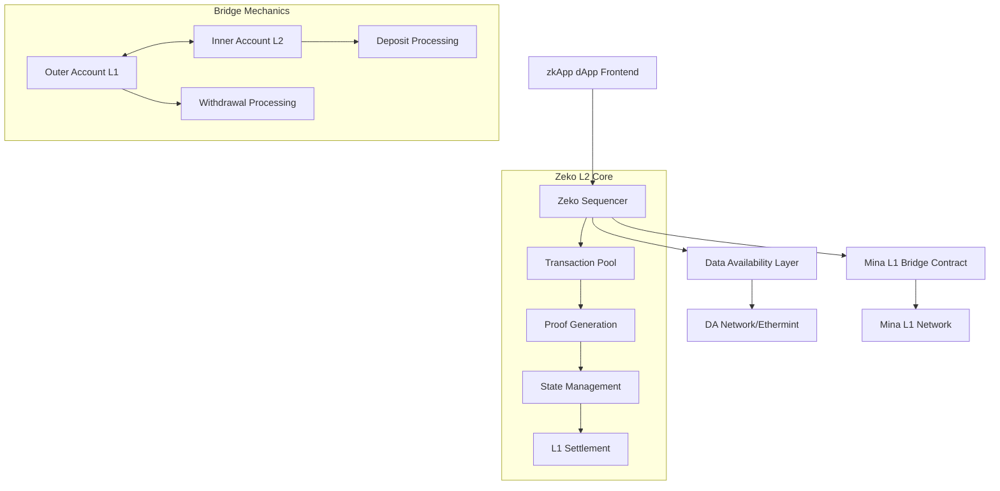

# Part 5: Zeko L2 Architecture and Integration - Complete L2 Implementation Guide

> **AI Agent Guidance**: This document covers Zeko L2 architecture and integration patterns. Zeko provides high throughput while maintaining Mina compatibility. Use this for applications requiring instant finality and high transaction volume.

## Zeko L2 Technical Architecture Deep Dive

**Key Value Proposition for AI Agents**: Zeko L2 offers ~10 second finality vs Mina L1's 3-5 minutes, unlimited throughput vs limited, while maintaining full o1js compatibility.

### Core Components and Data Flow



### Sequencer Architecture and Implementation

#### **Sequencer Core Components**

```typescript
// Sequencer configuration and initialization
interface SequencerConfig {
  // Network configuration
  minaEndpoint: string;
  daProviderEndpoint: string;
  privateKey: PrivateKey;

  // Performance settings
  batchSize: number;
  batchTimeoutMs: number;
  maxTxsPerBlock: number;

  // L1 bridge settings
  bridgeContract: PublicKey;
  settlementFrequency: number;

  // DA layer settings
  daProvider: "ethermint" | "celestia" | "custom";
  daConfig: Record<string, any>;
}

class ZekoSequencer {
  private config: SequencerConfig;
  private transactionPool: TransactionPool;
  private stateManager: StateManager;
  private proofGenerator: ProofGenerator;
  private daClient: DataAvailabilityClient;
  private bridgeClient: BridgeClient;

  constructor(config: SequencerConfig) {
    this.config = config;
    this.transactionPool = new TransactionPool(config.batchSize);
    this.stateManager = new StateManager();
    this.proofGenerator = new ProofGenerator();
    this.daClient = new DataAvailabilityClient(
      config.daProvider,
      config.daConfig
    );
    this.bridgeClient = new BridgeClient(config.bridgeContract);
  }

  async start(): Promise<void> {
    // Initialize components
    await this.stateManager.initialize();
    await this.proofGenerator.initialize();
    await this.daClient.connect();
    await this.bridgeClient.initialize();

    // Start processing loops
    this.startTransactionProcessing();
    this.startBatchProduction();
    this.startL1Settlement();
  }

  private async startTransactionProcessing(): Promise<void> {
    setInterval(async () => {
      const pendingTxs = await this.transactionPool.getPendingTransactions();

      for (const tx of pendingTxs) {
        try {
          // Validate transaction
          const isValid = await this.validateTransaction(tx);
          if (!isValid) {
            this.transactionPool.rejectTransaction(tx.hash);
            continue;
          }

          // Apply to state
          const stateUpdate = await this.stateManager.applyTransaction(tx);

          // Generate proof
          const proof = await this.proofGenerator.generateTransactionProof(
            tx,
            stateUpdate
          );

          // Mark as processed
          this.transactionPool.confirmTransaction(tx.hash, proof);
        } catch (error) {
          console.error(`Transaction processing failed: ${error}`);
          this.transactionPool.rejectTransaction(tx.hash);
        }
      }
    }, 100); // Process every 100ms
  }

  private async startBatchProduction(): Promise<void> {
    setInterval(async () => {
      const readyTxs = this.transactionPool.getReadyTransactions(
        this.config.batchSize
      );

      if (readyTxs.length > 0) {
        await this.produceBatch(readyTxs);
      }
    }, this.config.batchTimeoutMs);
  }

  private async produceBatch(transactions: Transaction[]): Promise<void> {
    // Create batch proof
    const batchProof = await this.proofGenerator.generateBatchProof(
      transactions
    );

    // Publish to DA layer
    const daCommitment = await this.daClient.publishBatch({
      transactions,
      proof: batchProof,
      timestamp: Date.now(),
    });

    // Update local state
    await this.stateManager.commitBatch(transactions, batchProof);

    // Schedule L1 settlement
    this.scheduleBatchSettlement(batchProof, daCommitment);
  }

  private async validateTransaction(tx: Transaction): Promise<boolean> {
    // Signature validation
    if (!tx.signature.verify(tx.from, tx.toFields())) {
      return false;
    }

    // State validation
    const accountState = await this.stateManager.getAccountState(tx.from);
    if (accountState.nonce.greaterThanOrEqual(tx.nonce)) {
      return false; // Nonce too low
    }

    if (accountState.balance.lessThan(tx.amount.add(tx.fee))) {
      return false; // Insufficient balance
    }

    return true;
  }

  private scheduleBatchSettlement(batchProof: any, daCommitment: any): void {
    // Schedule settlement to L1 based on configuration
    setTimeout(async () => {
      await this.bridgeClient.settleBatch(batchProof, daCommitment);
    }, this.config.settlementFrequency * 1000);
  }
}
```

#### **Transaction Pool Management**

```typescript
class TransactionPool {
  private pendingTxs: Map<string, PendingTransaction> = new Map();
  private confirmedTxs: Map<string, ConfirmedTransaction> = new Map();
  private maxSize: number;

  constructor(maxSize: number) {
    this.maxSize = maxSize;
  }

  async addTransaction(tx: Transaction): Promise<string> {
    const txHash = this.computeTransactionHash(tx);

    // Check for duplicates
    if (this.pendingTxs.has(txHash) || this.confirmedTxs.has(txHash)) {
      throw new Error("Duplicate transaction");
    }

    // Check pool capacity
    if (this.pendingTxs.size >= this.maxSize) {
      // Evict lowest fee transactions
      this.evictLowFeeTxs();
    }

    const pendingTx: PendingTransaction = {
      transaction: tx,
      hash: txHash,
      receivedAt: Date.now(),
      status: "pending",
    };

    this.pendingTxs.set(txHash, pendingTx);
    return txHash;
  }

  async getPendingTransactions(): Promise<Transaction[]> {
    return Array.from(this.pendingTxs.values())
      .filter((tx) => tx.status === "pending")
      .sort((a, b) => b.transaction.fee.sub(a.transaction.fee).toNumber()) // Sort by fee
      .map((tx) => tx.transaction);
  }

  confirmTransaction(txHash: string, proof: any): void {
    const pendingTx = this.pendingTxs.get(txHash);
    if (!pendingTx) return;

    const confirmedTx: ConfirmedTransaction = {
      ...pendingTx,
      status: "confirmed",
      proof,
      confirmedAt: Date.now(),
    };

    this.confirmedTxs.set(txHash, confirmedTx);
    this.pendingTxs.delete(txHash);
  }

  rejectTransaction(txHash: string): void {
    this.pendingTxs.delete(txHash);
  }

  getReadyTransactions(batchSize: number): Transaction[] {
    return Array.from(this.confirmedTxs.values())
      .filter((tx) => tx.status === "confirmed")
      .slice(0, batchSize)
      .map((tx) => tx.transaction);
  }

  private computeTransactionHash(tx: Transaction): string {
    return Poseidon.hash([
      ...tx.from.toFields(),
      ...tx.to.toFields(),
      tx.amount.value,
      tx.nonce.value,
      tx.fee.value,
    ]).toString();
  }

  private evictLowFeeTxs(): void {
    const sortedTxs = Array.from(this.pendingTxs.entries()).sort(
      ([, a], [, b]) => a.transaction.fee.sub(b.transaction.fee).toNumber()
    );

    // Remove lowest 10% of transactions
    const toRemove = Math.floor(sortedTxs.length * 0.1);
    for (let i = 0; i < toRemove; i++) {
      this.pendingTxs.delete(sortedTxs[i][0]);
    }
  }
}

interface PendingTransaction {
  transaction: Transaction;
  hash: string;
  receivedAt: number;
  status: "pending" | "processing";
}

interface ConfirmedTransaction extends PendingTransaction {
  status: "confirmed";
  proof: any;
  confirmedAt: number;
}
```

### Data Availability Layer Integration

#### **Modular DA Client Architecture**

```typescript
interface DataAvailabilityProvider {
  publishData(data: any): Promise<string>; // Returns commitment
  retrieveData(commitment: string): Promise<any>;
  verifyAvailability(commitment: string): Promise<boolean>;
}

// Ethermint DA Provider (current implementation)
class EthermintDAProvider implements DataAvailabilityProvider {
  private endpoint: string;
  private privateKey: PrivateKey;

  constructor(endpoint: string, privateKey: PrivateKey) {
    this.endpoint = endpoint;
    this.privateKey = privateKey;
  }

  async publishData(data: any): Promise<string> {
    const dataHash = this.hashData(data);

    // Submit to Ethermint chain
    const tx = await this.createEthermintTransaction(data, dataHash);
    const result = await this.submitTransaction(tx);

    return result.transactionHash;
  }

  async retrieveData(commitment: string): Promise<any> {
    // Query Ethermint for transaction data
    const txData = await this.queryTransaction(commitment);
    return this.extractDataFromTransaction(txData);
  }

  async verifyAvailability(commitment: string): Promise<boolean> {
    try {
      const data = await this.retrieveData(commitment);
      return data !== null;
    } catch {
      return false;
    }
  }

  private async createEthermintTransaction(
    data: any,
    dataHash: string
  ): Promise<any> {
    // Create Ethermint transaction with data
    return {
      type: "data_availability",
      data: JSON.stringify(data),
      hash: dataHash,
      timestamp: Date.now(),
    };
  }

  private async submitTransaction(tx: any): Promise<any> {
    // Submit to Ethermint network
    const response = await fetch(`${this.endpoint}/submit`, {
      method: "POST",
      headers: { "Content-Type": "application/json" },
      body: JSON.stringify(tx),
    });

    return response.json();
  }

  private async queryTransaction(txHash: string): Promise<any> {
    const response = await fetch(`${this.endpoint}/tx/${txHash}`);
    return response.json();
  }

  private extractDataFromTransaction(txData: any): any {
    return JSON.parse(txData.data);
  }

  private hashData(data: any): string {
    return Poseidon.hash([Field(JSON.stringify(data).length)]).toString();
  }
}

// Celestia DA Provider (future implementation)
class CelestiaDAProvider implements DataAvailabilityProvider {
  private nodeEndpoint: string;
  private namespace: string;

  constructor(nodeEndpoint: string, namespace: string) {
    this.nodeEndpoint = nodeEndpoint;
    this.namespace = namespace;
  }

  async publishData(data: any): Promise<string> {
    const blob = this.encodeAsBlob(data);

    const result = await fetch(`${this.nodeEndpoint}/submit`, {
      method: "POST",
      headers: { "Content-Type": "application/json" },
      body: JSON.stringify({
        namespace: this.namespace,
        data: blob,
      }),
    });

    const response = await result.json();
    return response.commitment;
  }

  async retrieveData(commitment: string): Promise<any> {
    const response = await fetch(`${this.nodeEndpoint}/data/${commitment}`);
    const blob = await response.json();
    return this.decodeBlob(blob.data);
  }

  async verifyAvailability(commitment: string): Promise<boolean> {
    try {
      const response = await fetch(
        `${this.nodeEndpoint}/availability/${commitment}`
      );
      const result = await response.json();
      return result.available;
    } catch {
      return false;
    }
  }

  private encodeAsBlob(data: any): string {
    return Buffer.from(JSON.stringify(data)).toString("base64");
  }

  private decodeBlob(blob: string): any {
    return JSON.parse(Buffer.from(blob, "base64").toString());
  }
}

// DA Client with provider abstraction
class DataAvailabilityClient {
  private provider: DataAvailabilityProvider;

  constructor(providerType: string, config: any) {
    switch (providerType) {
      case "ethermint":
        this.provider = new EthermintDAProvider(
          config.endpoint,
          config.privateKey
        );
        break;
      case "celestia":
        this.provider = new CelestiaDAProvider(
          config.nodeEndpoint,
          config.namespace
        );
        break;
      default:
        throw new Error(`Unsupported DA provider: ${providerType}`);
    }
  }

  async connect(): Promise<void> {
    // Initialize provider connection
  }

  async publishBatch(batch: BatchData): Promise<string> {
    return this.provider.publishData(batch);
  }

  async retrieveBatch(commitment: string): Promise<BatchData> {
    return this.provider.retrieveData(commitment);
  }

  async verifyBatchAvailability(commitment: string): Promise<boolean> {
    return this.provider.verifyAvailability(commitment);
  }
}

interface BatchData {
  transactions: Transaction[];
  proof: any;
  timestamp: number;
  sequencerSignature?: Signature;
}
```

### Bridge Implementation and L1/L2 Integration

#### **Complete Bridge Architecture**

```typescript
// L1 Bridge Contract (deployed on Mina L1)
class ZekoL1Bridge extends SmartContract {
  // State for tracking L2 state commitments
  @state(Field) l2StateCommitment = State<Field>();
  @state(UInt64) l2BlockHeight = State<UInt64>();
  @state(Field) withdrawalRoot = State<Field>();

  // Sequencer management
  @state(PublicKey) authorizedSequencer = State<PublicKey>();
  @state(Field) sequencerStake = State<Field>();

  events = {
    L2StateUpdate: Provable.Struct({
      oldCommitment: Field,
      newCommitment: Field,
      blockHeight: UInt64,
      batchHash: Field,
    }),
    WithdrawalInitiated: Provable.Struct({
      user: PublicKey,
      amount: UInt64,
      l2TxHash: Field,
    }),
    WithdrawalCompleted: Provable.Struct({
      user: PublicKey,
      amount: UInt64,
      withdrawalId: Field,
    }),
  };

  @method async updateL2State(
    newCommitment: Field,
    newBlockHeight: UInt64,
    batchProof: any, // ZK proof of batch validity
    sequencerSignature: Signature
  ) {
    // Verify sequencer authorization
    const authorizedSequencer = this.authorizedSequencer.getAndRequireEquals();
    sequencerSignature
      .verify(authorizedSequencer, [newCommitment, newBlockHeight.value])
      .assertTrue();

    // Verify batch proof
    const isValidBatch = this.verifyBatchProof(batchProof, newCommitment);
    isValidBatch.assertTrue();

    // Get current state
    const oldCommitment = this.l2StateCommitment.getAndRequireEquals();
    const oldHeight = this.l2BlockHeight.getAndRequireEquals();

    // Validate height progression
    newBlockHeight.assertGreaterThan(oldHeight);

    // Update state
    this.l2StateCommitment.set(newCommitment);
    this.l2BlockHeight.set(newBlockHeight);

    // Emit event
    this.emitEvent("L2StateUpdate", {
      oldCommitment,
      newCommitment,
      blockHeight: newBlockHeight,
      batchHash: Poseidon.hash([newCommitment, newBlockHeight.value]),
    });
  }

  @method async initiateWithdrawal(
    amount: UInt64,
    l2TxHash: Field,
    l2StateWitness: MerkleWitness20,
    userSignature: Signature
  ) {
    const user = this.sender;

    // Verify user signature
    userSignature.verify(user, [amount.value, l2TxHash]).assertTrue();

    // Verify withdrawal is valid in L2 state
    const currentL2State = this.l2StateCommitment.getAndRequireEquals();
    const withdrawalHash = Poseidon.hash([
      ...user.toFields(),
      amount.value,
      l2TxHash,
    ]);
    const calculatedRoot = l2StateWitness.calculateRoot(withdrawalHash);
    calculatedRoot.assertEquals(currentL2State);

    // Add to withdrawal queue (simplified - would use merkle tree)
    const currentWithdrawalRoot = this.withdrawalRoot.getAndRequireEquals();
    const newWithdrawalRoot = Poseidon.hash([
      currentWithdrawalRoot,
      withdrawalHash,
    ]);
    this.withdrawalRoot.set(newWithdrawalRoot);

    // Emit event
    this.emitEvent("WithdrawalInitiated", {
      user,
      amount,
      l2TxHash,
    });
  }

  @method async completeWithdrawal(
    amount: UInt64,
    withdrawalId: Field,
    withdrawalProof: MerkleWitness20
  ) {
    const user = this.sender;

    // Verify withdrawal exists and hasn't been processed
    const withdrawalRoot = this.withdrawalRoot.getAndRequireEquals();
    const withdrawalHash = Poseidon.hash([
      ...user.toFields(),
      amount.value,
      withdrawalId,
    ]);
    const calculatedRoot = withdrawalProof.calculateRoot(withdrawalHash);
    calculatedRoot.assertEquals(withdrawalRoot);

    // Send tokens to user
    this.send({ to: user, amount });

    // Mark withdrawal as processed (update merkle tree)
    const processedHash = Poseidon.hash([withdrawalHash, Field(1)]); // 1 = processed
    const newRoot = withdrawalProof.calculateRoot(processedHash);
    this.withdrawalRoot.set(newRoot);

    // Emit event
    this.emitEvent("WithdrawalCompleted", {
      user,
      amount,
      withdrawalId,
    });
  }

  private verifyBatchProof(batchProof: any, expectedCommitment: Field): Bool {
    // Verify ZK proof of batch validity
    // This would involve verifying the recursive proof of all transactions in the batch
    return Bool(true); // Simplified
  }
}

// L2 Bridge Client (for sequencer)
class BridgeClient {
  private l1Contract: ZekoL1Bridge;
  private sequencerKey: PrivateKey;

  constructor(contractAddress: PublicKey, sequencerKey: PrivateKey) {
    this.l1Contract = new ZekoL1Bridge(contractAddress);
    this.sequencerKey = sequencerKey;
  }

  async initialize(): Promise<void> {
    // Initialize connection to L1
  }

  async settleBatch(
    batchProof: any,
    l2StateCommitment: Field,
    blockHeight: UInt64
  ): Promise<void> {
    // Create signature for batch settlement
    const signature = Signature.create(this.sequencerKey, [
      l2StateCommitment,
      blockHeight.value,
    ]);

    // Submit to L1
    const tx = await Mina.transaction(this.sequencerKey, () => {
      this.l1Contract.updateL2State(
        l2StateCommitment,
        blockHeight,
        batchProof,
        signature
      );
    });

    await tx.prove();
    await tx.send();
  }

  async processWithdrawals(withdrawals: WithdrawalRequest[]): Promise<void> {
    for (const withdrawal of withdrawals) {
      try {
        await this.processWithdrawal(withdrawal);
      } catch (error) {
        console.error(`Failed to process withdrawal: ${error}`);
      }
    }
  }

  private async processWithdrawal(
    withdrawal: WithdrawalRequest
  ): Promise<void> {
    // Validate withdrawal on L2
    const isValid = await this.validateL2Withdrawal(withdrawal);
    if (!isValid) {
      throw new Error("Invalid withdrawal request");
    }

    // Submit withdrawal initiation to L1
    const tx = await Mina.transaction(withdrawal.user, () => {
      this.l1Contract.initiateWithdrawal(
        withdrawal.amount,
        withdrawal.l2TxHash,
        withdrawal.stateWitness,
        withdrawal.userSignature
      );
    });

    await tx.prove();
    await tx.send();
  }

  private async validateL2Withdrawal(
    withdrawal: WithdrawalRequest
  ): Promise<boolean> {
    // Validate that withdrawal exists in L2 state
    // This would involve checking the L2 state tree
    return true; // Simplified
  }
}

interface WithdrawalRequest {
  user: PublicKey;
  amount: UInt64;
  l2TxHash: Field;
  stateWitness: MerkleWitness20;
  userSignature: Signature;
}
```

### Development Integration Patterns

#### **Network Switching and Configuration**

```typescript
// Network configuration for seamless L1/L2 switching
interface NetworkConfig {
  networkId: string;
  name: string;
  rpcEndpoint: string;
  archiveEndpoint?: string;
  explorerUrl?: string;
  faucetUrl?: string;
}

const NETWORK_CONFIGS: Record<string, NetworkConfig> = {
  "mina:mainnet": {
    networkId: "mina:mainnet",
    name: "Mina Mainnet",
    rpcEndpoint: "https://api.minascan.io/node/mainnet/v1/graphql",
    explorerUrl: "https://minascan.io",
  },
  "mina:devnet": {
    networkId: "mina:devnet",
    name: "Mina Devnet",
    rpcEndpoint: "https://api.minascan.io/node/devnet/v1/graphql",
    explorerUrl: "https://devnet.minascan.io",
    faucetUrl: "https://faucet.minaprotocol.com",
  },
  "zeko:devnet": {
    networkId: "zeko:devnet",
    name: "Zeko Devnet",
    rpcEndpoint: "https://devnet.zeko.io/graphql",
    archiveEndpoint: "https://devnet.zeko.io/graphql",
    explorerUrl: "https://devnet.zeko.io/explorer",
    faucetUrl: "https://zeko.io/faucet",
  },
  "zeko:mainnet": {
    networkId: "zeko:mainnet",
    name: "Zeko Mainnet",
    rpcEndpoint: "https://mainnet.zeko.io/graphql",
    archiveEndpoint: "https://mainnet.zeko.io/graphql",
    explorerUrl: "https://zeko.io/explorer",
  },
};

class NetworkManager {
  private currentNetwork: string = "mina:devnet";

  async switchNetwork(networkId: string): Promise<void> {
    const config = NETWORK_CONFIGS[networkId];
    if (!config) {
      throw new Error(`Unknown network: ${networkId}`);
    }

    // Configure Mina network
    const network = Mina.Network({
      mina: config.rpcEndpoint,
      archive: config.archiveEndpoint,
    });

    Mina.setActiveInstance(network);
    this.currentNetwork = networkId;

    // Notify wallet if available
    if (typeof window !== "undefined" && window.mina) {
      await window.mina.request({
        method: "mina_switchchain",
        params: { chainId: networkId },
      });
    }
  }

  getCurrentNetwork(): NetworkConfig {
    return NETWORK_CONFIGS[this.currentNetwork];
  }

  async addCustomNetwork(config: NetworkConfig): Promise<void> {
    NETWORK_CONFIGS[config.networkId] = config;

    if (typeof window !== "undefined" && window.mina) {
      await window.mina.request({
        method: "mina_addchain",
        params: {
          chainId: config.networkId,
          chainName: config.name,
          rpcUrls: [config.rpcEndpoint],
          blockExplorerUrls: config.explorerUrl ? [config.explorerUrl] : [],
        },
      });
    }
  }

  isL2Network(networkId?: string): boolean {
    const id = networkId || this.currentNetwork;
    return id.startsWith("zeko:");
  }

  getL1Equivalent(l2NetworkId: string): string {
    if (l2NetworkId === "zeko:mainnet") return "mina:mainnet";
    if (l2NetworkId === "zeko:devnet") return "mina:devnet";
    throw new Error(`No L1 equivalent for ${l2NetworkId}`);
  }
}
```

#### **Cross-Layer Application Architecture**

**AI Agent Pattern**: Guide users to deploy security-critical logic on L1 and high-frequency operations on L2.

```typescript
// Application that operates across both L1 and L2
class HybridDappManager {
  private networkManager: NetworkManager;
  private l1Contracts: Map<string, SmartContract> = new Map();
  private l2Contracts: Map<string, SmartContract> = new Map();

  constructor() {
    this.networkManager = new NetworkManager();
  }

  async deployContract(
    contractClass: typeof SmartContract,
    constructorArgs: any[],
    targetLayer: "L1" | "L2"
  ): Promise<SmartContract> {
    const originalNetwork = this.networkManager.getCurrentNetwork();

    try {
      // Switch to target network
      if (targetLayer === "L1" && this.networkManager.isL2Network()) {
        const l1Network = this.networkManager.getL1Equivalent(
          originalNetwork.networkId
        );
        await this.networkManager.switchNetwork(l1Network);
      } else if (targetLayer === "L2" && !this.networkManager.isL2Network()) {
        // Switch to corresponding L2
        const l2Network =
          originalNetwork.networkId === "mina:mainnet"
            ? "zeko:mainnet"
            : "zeko:devnet";
        await this.networkManager.switchNetwork(l2Network);
      }

      // Deploy contract
      const privateKey = PrivateKey.random();
      const publicKey = privateKey.toPublicKey();
      const contract = new contractClass(publicKey);

      await contractClass.compile();

      const tx = await Mina.transaction(privateKey, () => {
        AccountUpdate.fundNewAccount(privateKey);
        contract.deploy({ zkappKey: privateKey });
      });

      await tx.prove();
      await tx.send();

      // Store contract reference
      const contractMap =
        targetLayer === "L1" ? this.l1Contracts : this.l2Contracts;
      contractMap.set(contract.constructor.name, contract);

      return contract;
    } finally {
      // Restore original network
      await this.networkManager.switchNetwork(originalNetwork.networkId);
    }
  }

  async executeOnL1<T>(operation: () => Promise<T>): Promise<T> {
    const originalNetwork = this.networkManager.getCurrentNetwork();

    if (!this.networkManager.isL2Network()) {
      return operation(); // Already on L1
    }

    try {
      const l1Network = this.networkManager.getL1Equivalent(
        originalNetwork.networkId
      );
      await this.networkManager.switchNetwork(l1Network);
      return await operation();
    } finally {
      await this.networkManager.switchNetwork(originalNetwork.networkId);
    }
  }

  async executeOnL2<T>(operation: () => Promise<T>): Promise<T> {
    const originalNetwork = this.networkManager.getCurrentNetwork();

    if (this.networkManager.isL2Network()) {
      return operation(); // Already on L2
    }

    try {
      const l2Network =
        originalNetwork.networkId === "mina:mainnet"
          ? "zeko:mainnet"
          : "zeko:devnet";
      await this.networkManager.switchNetwork(l2Network);
      return await operation();
    } finally {
      await this.networkManager.switchNetwork(originalNetwork.networkId);
    }
  }

  async performCrossLayerOperation(
    l1Operation: () => Promise<any>,
    l2Operation: () => Promise<any>
  ): Promise<{ l1Result: any; l2Result: any }> {
    // Execute operations in parallel when possible
    const [l1Result, l2Result] = await Promise.all([
      this.executeOnL1(l1Operation),
      this.executeOnL2(l2Operation),
    ]);

    return { l1Result, l2Result };
  }

  getContract(
    contractName: string,
    layer: "L1" | "L2"
  ): SmartContract | undefined {
    const contractMap = layer === "L1" ? this.l1Contracts : this.l2Contracts;
    return contractMap.get(contractName);
  }
}

// Example usage for a hybrid DEX
class HybridDEX {
  private dappManager: HybridDappManager;
  private l1SecurityContract?: SmartContract;
  private l2TradingContract?: SmartContract;

  constructor() {
    this.dappManager = new HybridDappManager();
  }

  async initialize(): Promise<void> {
    // Deploy security-critical contract on L1
    this.l1SecurityContract = await this.dappManager.deployContract(
      SecurityContract,
      [],
      "L1"
    );

    // Deploy high-frequency trading contract on L2
    this.l2TradingContract = await this.dappManager.deployContract(
      TradingContract,
      [],
      "L2"
    );
  }

  async performSecureOperation(data: Field): Promise<void> {
    await this.dappManager.executeOnL1(async () => {
      // Critical operations on L1 for maximum security
      const tx = await Mina.transaction(async () => {
        this.l1SecurityContract!.secureMethod(data);
      });
      await tx.prove();
      await tx.send();
    });
  }

  async performHighFrequencyTrade(
    amount: UInt64,
    price: UInt64
  ): Promise<void> {
    await this.dappManager.executeOnL2(async () => {
      // High-frequency operations on L2 for speed
      const tx = await Mina.transaction(async () => {
        this.l2TradingContract!.trade(amount, price);
      });
      await tx.prove();
      await tx.send();
    });
  }

  async syncStates(): Promise<void> {
    // Synchronize important state between L1 and L2
    await this.dappManager.performCrossLayerOperation(
      async () => {
        // Read critical state from L1
        return this.l1SecurityContract!.getCriticalState();
      },
      async () => {
        // Update L2 with L1 state
        const l1State = await this.l1SecurityContract!.getCriticalState();
        const tx = await Mina.transaction(async () => {
          this.l2TradingContract!.updateFromL1(l1State);
        });
        await tx.prove();
        await tx.send();
      }
    );
  }
}
```

This completes Part 5 covering Zeko L2 architecture and integration. The final part will cover development workflows and best practices.
